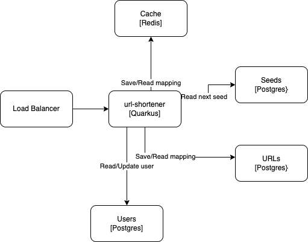

# url-shortener Project

Shortens URLs using a Base62 encoding.

## Features

- Scalable
- No collisions
- Base62 algorithm supports 7^62 unique keys at 7 characters length
- LRU cache
- Quota limits per user

## Description

The system has three components:

- A web-application (Quarkus)
- A relational database (Postgres)
- A cache (Redis)

Clustering the web application in order to serve more requests behind a load-balancer is possible.



When each server of the cluster starts up, it requests a `seed` from the DB. The `seed` is a DB sequence which returns the next number each time it is called, in an atomic operation.

The `seed` is converted into a `range` of numbers of `RANGE_SIZE`:

```
rangeStart = seed * RANGE_SIZE
rangeEnd = rangeStart + RANGE_SIZE -1
```

> **_NOTE_** By creating a range we avoid having to call the DB on each request.

The `range` is then added to a stack.

Each time a request to shorten a URL is requested we pop a number from the stack and encode it to a Base62 representation.

> **_NOTE_** By encoding a unique number we are avoiding collisions

When the stack runs out of numbers, we request a new `seed` from the DB and start over.

## TODOS

- Refilling the stack SHOULD be handled offline by a scheduled task.
- A NoSQL DB would be easier to scale horizontally for a large number of URLs

## Running the application locally

Build the application

```shell script
mvn clean install
```

Boot up the environment using docker compose

```shell script
docker compose up --build 
```

Server is running at `http://localhost:8080/`

A sample request to shorten a URL:

```http request
POST http://localhost:8080/api/shorten
Content-Type: application/json
X-API-Key: 12345678

{
  "url": "https://www.google.com/98u123u8123hu12398h123"
}

```